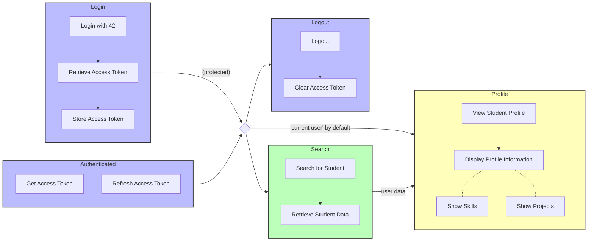
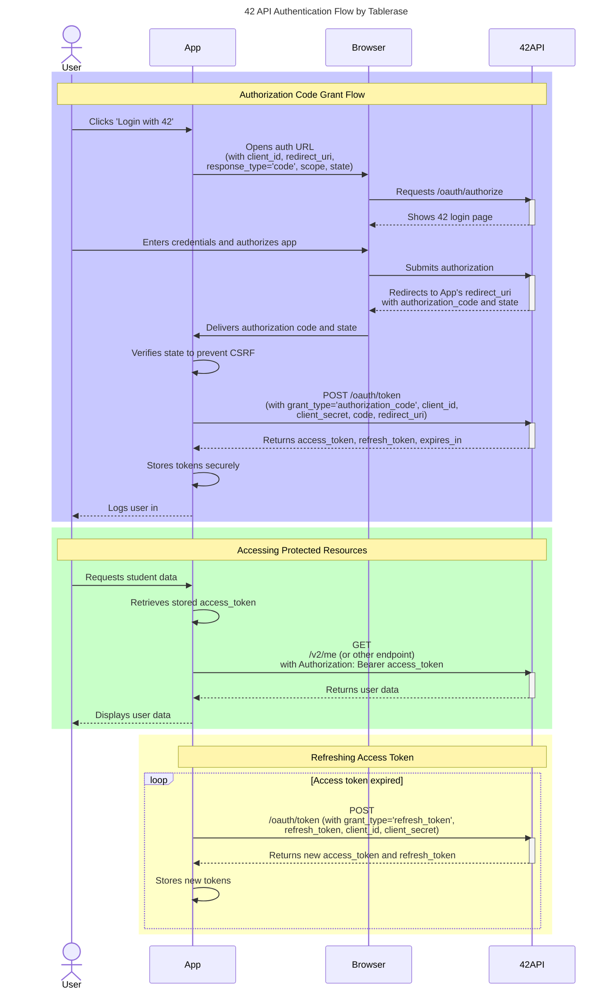

# 42_Swifty-Companion


The aim of the project is to build an application that will retrieve the information of 42 students, using the 42 API v2. The application will allow users to log in with their 42 account, search for students by login, and view their information, including skills, projects, level, etc.

## Features

- Login with 42 account
- Search for a student by login
- View student information
- Display skills and projects



## Installation

1. Clone the repository:
   ```bash
   git clone
   ```
2. Navigate to the project directory:
   ```bash
   cd 42Companion
   ```
3. Install dependencies:
   ```bash
   npm install
   ```
> [!NOTE]\
> Make sure you have the 42 API credentials before proceeding.
>
> - You can register your application on the 42 API [here](https://profile.intra.42.fr/oauth/applications/new).
4. Configure the app:
   - Use the `.env.example` file to create a `.env` file with your 42 API information.
     - Copy the `.env.example` file to `.env`:
       ```bash
       cp .env.example .env
       ```
     - Set the `EXPO_PUBLIC_42API_CLIENT_ID` and `EXPO_PUBLIC_42API_CLIENT_SECRET` with your 42 API credentials.
   - Modify the `authConfig.ts` file to set the correct:
     - `REDIRECT_URI` to match your app's configuration and check if the `ENDPOINTS` are correct.
   - Generate assets/fonts/services files for Android:
     - Run the following command to generate the necessary assets and services files:
       ```bash
       npx expo prebuild
       ```
     - This will create the `android/app/src/main/res` directory with the necessary files.
6. Start the development server:
   ```bash
   # If you want to use the tunnel connection, which is useful for testing on physical devices, run:
   npx expo start --tunnel --dev-client
   ```
   ```
   npx expo start
   ```
7. Building the development client:
   ```bash
   npx expo run:android
   ```
   - If change to assets or native code don't forget to rebuild the development client. If that does not work, try:
     ```bash
       npx expo prebuild
     ```
8. Open the app on your device or emulator (if not already running).

## 42 API

The 42 API is used to retrieve student information. You can find the documentation [here](https://api.intra.42.fr/apidoc).

- Getting started: https://api.intra.42.fr/apidoc/guides/getting_started
- App registration: https://profile.intra.42.fr/oauth/applications/new
- API Flow: https://api.intra.42.fr/apidoc/guides/web_application_flow
- Refresh token info: https://www.rfc-editor.org/rfc/rfc6749#section-3.2



## RadarCharts

Here we use `react-native-gifted-charts` to display the radar charts for skills and projects. The library provides a simple way to create radar charts in React Native applications.

- To use actual version, `newArchEnabled` must be set to `false` in `app.json` because the library is not compatible with the new architecture.
